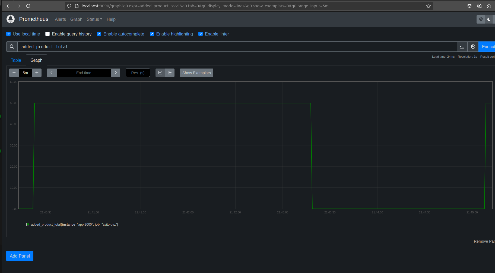

# Тестовое задание на стажировку в Авито

## Описание
В этом репозитории представлена реализация бэкенда для сервиса ПВЗ. Взаимодейстовать с сервисом можно таким образом:

1. Для взаимодействия необходимо получить токен. Авторизация происходит двумя способами: базовый способ через эндпоинт `/dummyLogin` или можно зарегистрироваться через `/register`, потом залогиниться через `/login` и получить `jwt` токен.
2. Модератор может создать ПВЗ через эндпоинт `/pvz`.
3. Сотрудник ПВЗ может создавать приемки товаров, добавлять и удалять из них товары, а также закрывать приемки.

## Стек
HTTP сервер написан на Go с использованием веб-фреймворка [gin](https://gin-gonic.com/).

Часть кода для сервера сгенерирована при помощи [oapi-codegen](https://github.com/oapi-codegen/oapi-codegen).

Для взаимодействия с БД и кодегенерации используется [sqlc](https://sqlc.dev/).

Для генерации и проверки jwt-токенов используется библиотека [golang-jwt](https://github.com/golang-jwt/jwt).

Для хранения данных используется PostgreSQL, в котором с помощью миграций созданы таблицы с пользователями, ПВЗ, приёмками заказов, товаров. В базе созданы индексы для быстрого поиска и триггеры для предотвращения ошибок.

Реализован дополнительный gRPC-метод для получения набора ПВЗ. gRPC-сервер работает на порту :3000. 

Сбор нужных метрик осуществляется при помощи Prometheus. Их можно просмотреть локально на порту :9090.


## Сборка

Сборка в контейнере осуществляется при помощи `Docker`.
В `Makefile` прописаны короткие инструкции для запуска.

Шаг 1. Склонировать репозиторий себе локально и перейти в него:

```
git clone https://github.com/AnikinSimon/avito-test-backend.git
cd avito-test-backend
```

Шаг 2. Для запуска сервиса:

```
make run
```

или
```
docker compose up --build -d
```
Шаг 3. Для остановки сервиса после работы нужно выполнить:
```
make stop
```
или
```
docker compose down
```

## Тестировние
Чтобы запустить unit-тесты, выполните: 
```
make unit
```

Чтобы запустить все тесты (включая интеграционные), выполните: 
```
make test
```

> Для того, чтобы правильно запустились интеграционные тесты, сервис должен быть предварительно запущен, как показано выше.